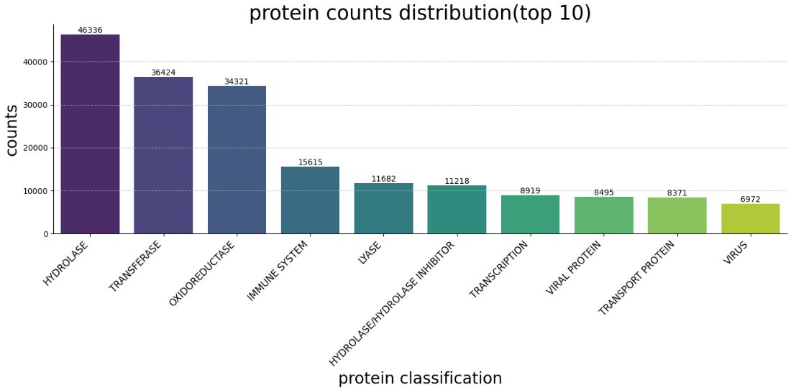
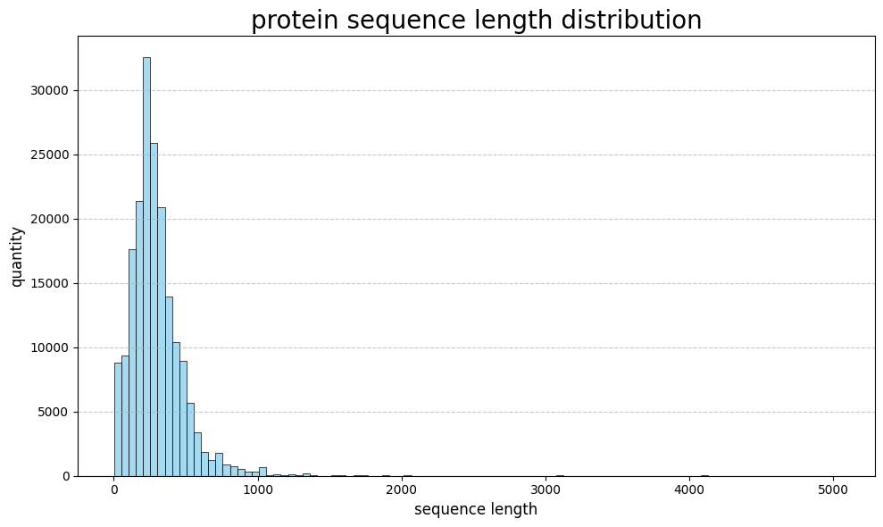
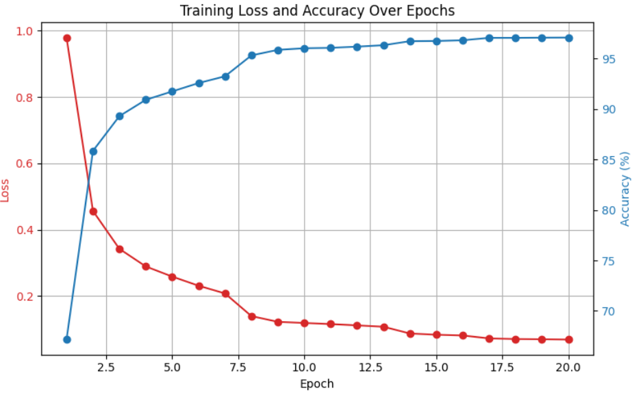
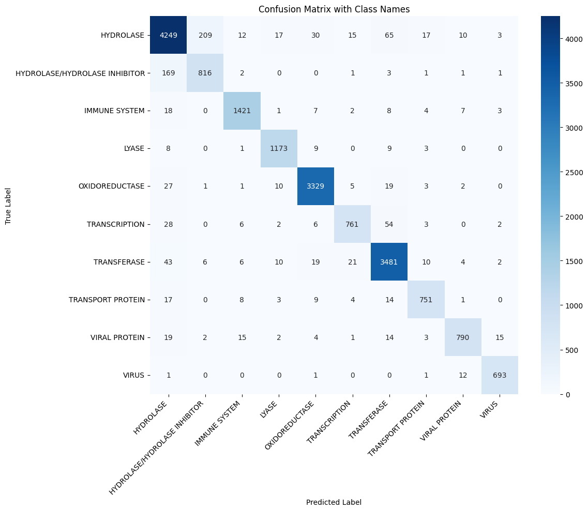

# Predicting-Protein-Classification

## 1. Introduction
Protein is a kind of macromolecule made up of long amino acid chains, and the sequence of the chain plays a vital role in how the protein folds as well as its function.  
In this project, a simple model based on **LSTM** is designed to classify proteins according to their amino acid sequences.

## 2. Dataset description
The dataset used in this project is from the [Structural Protein Sequences](https://www.kaggle.com/datasets/shahir/protein-data-set) on Kaggle. It consists of two `.csv` files:  

- **pdb_data_no_dups.csv**: Contains protein metadata, including classification, extraction methods, etc.  
- **pdb_data_seq.csv**: Contains >400,000 protein structure sequences.  

Since the raw dataset contains much information irrelevant to the classification task, a preprocessing script (`transform.py`) was written to extract only **protein sequences** and their **classifications**, resulting in a new file:  
`protein_sequence_classification.csv`.  

The number of classifications in this file is large. Therefore, the **10 most frequent protein types** were selected to form the dataset. The counts of each class are shown in the figure below.  
The dataset is split into **training** and **testing** sets at a **9:1** ratio.

## 3. Data preprocessing
The following preprocessing steps were applied:

1. **Sequence Truncation and Elimination**  
   After analyzing the distribution of protein sequence length(statistics shown in the figure below), it can be found that protein sequences vary greatly in length. Sequences longer than a predefined maximum length (set to the 95th percentile of all sequence lengths) are truncated, while extremely short sequences that may lack sufficient structural information are removed. 

2. **Padding**  
   All sequences are padded with a special token (`<PAD>`) so that they have equal lengths. This allows batch processing and compatibility with the LSTM model.
3. **Encoding Amino Acids**  
  Each amino acid was mapped to an integer index using a vocabulary dictionary.  

4. **Embedding**  
   An embedding layer was used to convert integer-encoded sequences into dense vectors, allowing the model to learn a representation of amino acids in a continuous space.

## 4. Methods
A sequence classification model is built using an LSTM-based architecture:

- Embedding layer: Converts integer-encoded amino acids into fixed-dimensional dense vectors.

- LSTM layer: Captures long-range dependencies in amino acid sequences and learns sequential patterns.

- Fully connected layer: Outputs the classification logits for the 10 selected protein classes.

- Loss function: Cross-entropy loss is used for multi-class classification.

- Optimizer: Adam optimizer with an initial learning rate of 0.001.

- The model is trained for 20 epochs with early stopping based on validation accuracy.

## 5. Results
The training process shows that the loss decreases steadily while accuracy improves over epochs, indicating effective learning. The final training accuracy reaches **97.09%** after 20 epochs. The loss and training acuracy in each epoch are shown in the figure below.

The model achieves a high classification accuracy of **94.22%** on the test set, suggesting that the LSTM effectively captures sequence patterns in the protein data. The confussion matrix on the test set is shown in the figure below.

## 6. Discussion
The experimental results demonstrate that an LSTM-based approach can achieve high accuracy in protein classification, even with a relatively simple architecture. However, there are several limitations and possible improvements:

- Class imbalance: The dataset is dominated by certain protein classes, which may bias the model. Data augmentation or re-sampling strategies could address this.

- Sequence representation: The current model uses learned embeddings without incorporating biochemical properties of amino acids. Incorporating physicochemical features may enhance performance.

- Model complexity: Although the simple LSTM works well here, more advanced architectures such as transformers or convolutional neural networks (CNNs) could further improve accuracy and generalization.

## 7. Conclusion
This project successfully demonstrates the feasibility of protein sequence classification using an LSTM-based model. With appropriate preprocessing, even a simple architecture can achieve high accuracy. Future work will focus on integrating richer amino acid features, experimenting with hybrid architectures, and addressing class imbalance for more robust performance.
