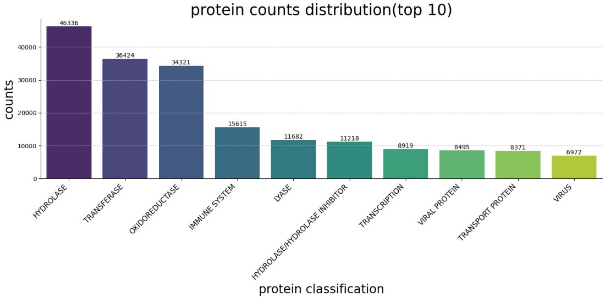

# Predicting-Protein-Classification

## 1. Introduction
  Protein is a kind of macromolecules made up of long amino acid chains, and the sequence of the chain plays a vital role in how the protein folds as well as the function of it. In this project, a simple model based on LSTM is designed to classify proteins according to their amino acid sequence. 
## 2. Dataset description
 The dataset used in this project is from the (Structural Protein Sequences)[https://www.kaggle.com/datasets/shahir/protein-data-set] in Kaggle. It consists of two .csv files: the first one, pdb_data_no_dups.csv, contains protein meta data which includes details on protein classification, extraction methods, etc.; and the other, pdb_data_seq.csv, contains >400,000 protein structure sequences. Given that the two files contain much information useless for this task, to begin with, a program named transform.py is written to extract the sequences and the classifications related to that, and create a new protein_sequence_classification.csv file. 

 The number of classifications in this file is large, therefore 10 types of proteins which has the most samples are selected as the dataset. The counts of them are showed in the figure below. The dataset is then divided into train set and test set with their sizes at the ratio of 9:1. 

 
## 3. Data preprocessing
1. **Sequence Truncation and Elimination:**
2. **Padding:**
3. **Embedding:**
## 4. Methods

## 5. Results

## 6. Discussion

## 7. Conclusion
